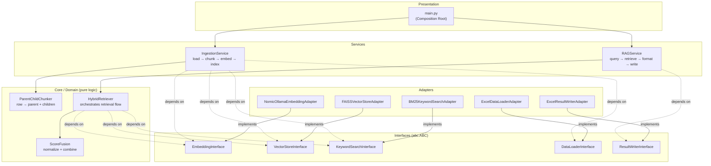
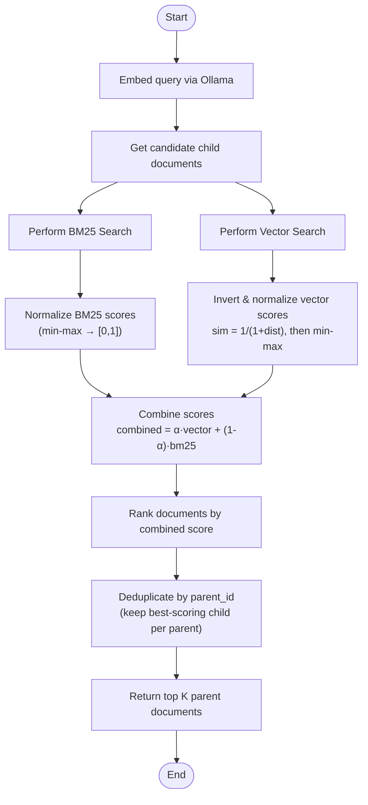

# Simple RAG — Retrieval-Augmented Generation for GNEM Data

A production-grade **Simple RAG (Retrieval-Augmented Generation)** pipeline that retrieves contextually relevant company records from the Georgia New Energy Mobility (GNEM) dataset using **hybrid retrieval** — combining dense semantic search (FAISS + Nomic Embed Text) with sparse keyword search (BM25). The project follows **layered architecture**, **SOLID principles**, and the **adapter pattern** so that every external integration can be swapped with zero changes to core logic.

---

## Architecture

### Layered Architecture



### Hybrid Retrieval Flow



---

## Folder Structure

```
simple_rag/
├── README.md                          # This file
├── requirements.txt                   # Pinned dependencies
├── main.py                            # Composition root + CLI entry point
├── config/
│   └── config.yaml                    # All configuration in one place
├── data/
│   ├── GNEM_final_data.xlsx           # User places the GNEM dataset here
│   └── questions.xlsx                 # 50 questions (user-provided)
├── output/
│   ├── .gitkeep                       # Placeholder for git
│   └── contexts.xlsx                  # Pipeline output (generated)
├── src/
│   ├── __init__.py
│   ├── exceptions.py                  # Custom exception hierarchy
│   ├── interfaces/                    # abc.ABC definitions
│   │   ├── embedding_interface.py
│   │   ├── vector_store_interface.py
│   │   ├── keyword_search_interface.py
│   │   ├── data_loader_interface.py
│   │   └── result_writer_interface.py
│   ├── adapters/                      # Concrete external integrations
│   │   ├── nomic_ollama_embedding_adapter.py
│   │   ├── faiss_vector_store_adapter.py
│   │   ├── bm25_keyword_search_adapter.py
│   │   ├── excel_data_loader_adapter.py
│   │   └── excel_result_writer_adapter.py
│   ├── core/                          # Pure domain logic (no I/O)
│   │   ├── parent_child_chunker.py    # Row → parent + field-grouped children
│   │   ├── hybrid_retriever.py        # Orchestrates the retrieval flow
│   │   └── score_fusion.py            # Min-max norm + invert + weighted sum
│   ├── services/                      # Orchestration use-cases
│   │   ├── ingestion_service.py       # load → chunk → embed → index
│   │   └── rag_service.py             # query → retrieve → write output
│   └── utils/
│       ├── config_loader.py           # YAML config loading + validation
│       └── logger.py                  # Centralised logging configuration
└── tests/
    ├── test_chunker.py                # Parent-child chunker tests
    ├── test_score_fusion.py           # Score normalisation math tests
    └── test_adapters_contracts.py     # Adapter → interface LSP tests
```

---

## Tech Stack

| Component | Library | Version |
|---|---|---|
| Dense embeddings | `nomic-embed-text` via Ollama | — |
| Vector store | `faiss-cpu` | 1.8.0 |
| Keyword search | `rank-bm25` | 0.2.2 |
| Data handling | `pandas` + `openpyxl` | 2.2.2 / 3.1.2 |
| Configuration | `pyyaml` | 6.0.1 |
| Math | `numpy` | 1.26.4 |
| HTTP client | `requests` | 2.31.0 |
| Testing | `pytest` | 8.2.2 |
| Python | 3.10+ | — |

**Why FAISS?** FAISS is chosen for simplicity and zero-server overhead. It runs entirely in-process — no separate database server to install, configure, or manage. For the ~5,000 child chunks in this dataset, exact nearest-neighbour search with `IndexFlatL2` is fast enough and avoids the complexity of approximate indices.

---

## Prerequisites

Ollama is assumed to be **already installed** on your machine. You need to:

1. **Pull the embedding model:**
   ```bash
   ollama pull nomic-embed-text
   ```

2. **Ensure Ollama is running:**
   ```bash
   ollama serve
   ```
   (The server listens on `http://localhost:11434` by default.)

---

## Installation

```bash
cd simple_rag/
pip install -r requirements.txt
```

---

## Configuration Walkthrough

All settings live in `config/config.yaml`:

| Key | Purpose |
|---|---|
| `paths.input_data` | Path to the GNEM Excel file (relative to `simple_rag/`) |
| `paths.questions` | Path to the questions Excel file |
| `paths.output` | Where to write the output Excel file |
| `paths.index_dir` | Directory for persisting the FAISS index cache |
| `data.sheet_name` | Worksheet name to read from the GNEM file |
| `data.text_columns` | Ordered list of columns to use from the dataset |
| `chunking.child_groups` | Field groupings for child chunks (configurable, not hardcoded) |
| `embedding.provider` | Embedding provider identifier |
| `embedding.model` | Ollama model name |
| `embedding.ollama_host` | Ollama server URL |
| `embedding.batch_size` | Texts per embedding batch |
| `embedding.request_timeout_seconds` | HTTP timeout for Ollama requests |
| `retrieval.top_k` | Number of parent documents to return (default: 60) |
| `retrieval.semantic_weight` | Alpha (α) — vector contribution to combined score |
| `retrieval.keyword_weight` | 1-α — BM25 contribution |
| `retrieval.candidate_pool_size` | Candidates fetched from each retriever before fusion |
| `logging.level` | Log verbosity (`DEBUG`, `INFO`, `WARNING`, etc.) |

---

## Data Setup

Place `GNEM_final_data.xlsx` in the `simple_rag/data/` directory. The expected schema on `Sheet1`:

| Column | Type | Notes |
|---|---|---|
| Company | str | Primary identifier |
| Category | str | e.g., "Tier 2/3", "OEM" |
| Industry Group | str | — |
| Updated Location | str | City, county |
| Address | str | Full street address |
| Latitude | float | — |
| Longitude | float | — |
| Primary Facility Type | str | — |
| EV Supply Chain Role | str | — |
| Primary OEMs | str | — |
| Supplier or Affiliation Type | str | — |
| Employment | int/float | May be missing |
| Product / Service | str | Free text |
| EV / Battery Relevant | str | "Direct" / "Indirect" / "No" |
| Classification Method | str | — |

The file is expected to have ~1,171 rows. Trailing empty columns are ignored automatically.

---

## How to Run

A single command runs the full pipeline end-to-end:

```bash
cd simple_rag/
python main.py
```

**Pipeline stages:**
1. Load configuration from `config/config.yaml`.
2. Load GNEM data → chunk into parent + child records.
3. Embed child chunks via Ollama (`nomic-embed-text`).
4. Build FAISS vector index + BM25 keyword index.
5. Query all 50 questions through the hybrid retrieval flow.
6. Write results to `output/contexts.xlsx`.

---

## How to Extend

### Example: Swap Nomic Embed Text for OpenAI Embeddings

1. Create `src/adapters/openai_embedding_adapter.py`:
   ```python
   from src.interfaces.embedding_interface import EmbeddingInterface

   class OpenAIEmbeddingAdapter(EmbeddingInterface):
       def embed_texts(self, texts: list[str]) -> list[list[float]]:
           # Call OpenAI API here
           ...

       def embed_query(self, query: str) -> list[float]:
           # Call OpenAI API here
           ...
   ```

2. Update `main.py` — replace the adapter instantiation:
   ```python
   # Before:
   embedding = NomicOllamaEmbeddingAdapter(...)
   # After:
   from src.adapters.openai_embedding_adapter import OpenAIEmbeddingAdapter
   embedding = OpenAIEmbeddingAdapter(api_key="sk-...")
   ```

3. **Zero changes** to `src/core/`, `src/services/`, or `src/interfaces/`. The hybrid retriever, score fusion, and ingestion service work identically because they depend on `EmbeddingInterface`, not on any concrete adapter.

---

## SOLID Applied

### Single Responsibility Principle (SRP)
Each class has one reason to change. `ParentChildChunker` only chunks — it doesn't embed, retrieve, or write files. `HybridRetriever` only retrieves — it doesn't load data. `ExcelResultWriterAdapter` only writes — it doesn't score.

### Open/Closed Principle (OCP)
Adding a new embedding provider, vector store, or data source requires creating **one new adapter file** and updating the wiring in `main.py`. Core logic, services, and interfaces remain untouched.

### Liskov Substitution Principle (LSP)
Every adapter is a drop-in replacement for its interface. `test_adapters_contracts.py` verifies that each adapter is a proper subclass, passes `isinstance` checks, and has all abstract methods concretely implemented.

### Interface Segregation Principle (ISP)
Interfaces are narrow and focused. `EmbeddingInterface` only embeds (two methods). `ResultWriterInterface` only writes (one method). No client is forced to depend on methods it doesn't use.

### Dependency Inversion Principle (DIP)
Services and core modules import from `src/interfaces/`, never from `src/adapters/`. Concrete adapter instantiation and wiring happens **only** in `main.py` (the composition root). This is explicitly visible in the import statements of every file.

---

## Retrieval Algorithm Details

The hybrid retrieval algorithm in `src/core/score_fusion.py` uses the following math:

### BM25 Normalisation
```
bm25_norm = (score - min) / (max - min)
```
Min-max scaling to [0, 1]. Higher is better. When all scores are equal, returns 1.0 for every candidate.

### Vector Score Normalisation
```
similarity = 1 / (1 + distance)       # Invert distance → similarity
vector_norm = (sim - min) / (max - min)  # Min-max to [0, 1]
```
FAISS returns L2 distances (lower = better). The inversion maps distance 0 → similarity 1.0 and large distances → near 0. The subsequent min-max ensures the output range is [0, 1].

If a store already returns cosine similarity (higher = better), the inversion step is a no-op — set `already_similarity=True` — but min-max normalisation still runs.

### Weighted Combination
```
combined = α × vector_norm + (1 - α) × bm25_norm
```
Where `α = retrieval.semantic_weight` from `config.yaml` (default 0.6). This gives 60% weight to semantic similarity and 40% to keyword relevance.

### Deduplication
After ranking by combined score, the pipeline deduplicates by `parent_id`, keeping only the **best-scoring child** per parent. This ensures each company appears at most once in the final results.

---

## Limitations & Future Work

- **No LLM generation step** — This pipeline retrieves relevant context but does not generate answers. Adding an LLM generation step (e.g., via Ollama's chat endpoint) would complete the RAG loop.
- **Simple tokenisation** — BM25 uses whitespace tokenisation. A production system might benefit from stemming, lemmatisation, or domain-specific tokenisation.
- **No incremental indexing** — The pipeline rebuilds the full index on every run. For large datasets, incremental updates would be more efficient.
- **Single embedding model** — Only `nomic-embed-text` is supported. The adapter pattern makes adding alternatives straightforward.
- **No query expansion** — Questions are embedded as-is. Techniques like HyDE or query decomposition could improve recall.
- **No reranking** — A cross-encoder reranker after initial retrieval could improve precision.
- **Cache invalidation** — The FAISS index is saved to `.cache/` but there's no check for data staleness. If the source data changes, delete `.cache/` and re-run.
